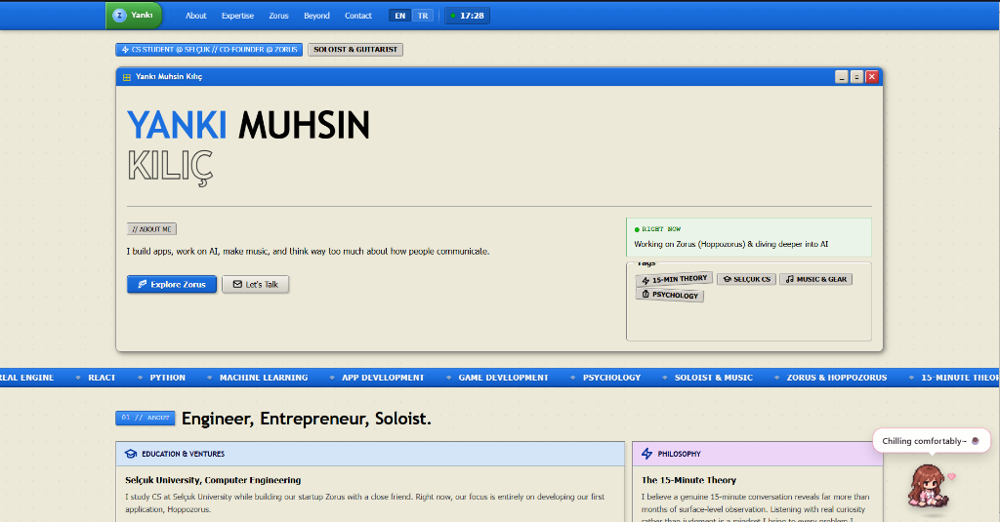

<div align="center">

# Yankı Muhsin Kılıç — Personal Portfolio

**A neo-brutalist, Windows XP–inspired personal portfolio built with React 19 & Vite**

[](https://myankilic.netlify.app)
[](https://react.dev)
[](https://vitejs.dev)
[](./LICENSE)



</div>

---

## ✨ Features

- 🖥️ **Windows XP Neo-Brutalist UI** — Authentic XP chrome (title bars, window controls, group boxes) reimagined as a modern portfolio
- 🤖 **Interactive Companion Mascot** — Animated chibi character that reacts to scroll position and user actions
- 🌿 **cbonsai Terminal** — Live ASCII bonsai tree animation inside the About section
- 🎵 **Vinyl Record Player** — Interactive music player in the Beyond section (Duman tribute)
- 🌐 **EN / TR Bilingual** — Full English & Turkish language toggle
- 🎞️ **Smooth Animations** — Framer Motion + GSAP powered transitions and interactions
- 📜 **Lenis Smooth Scroll** — Buttery smooth scrolling experience
- 📱 **Responsive** — Works across desktop and mobile viewports

---

## 🛠️ Tech Stack

| Layer | Technology |
|-------|-----------|
| Framework | React 19 |
| Build Tool | Vite 8 |
| Animations | Framer Motion 12, GSAP 3 |
| Scroll | Lenis |
| Deployment | Netlify |
| Styling | Pure CSS (custom neo-brutalist design system) |

---

## 📁 Project Structure

```
src/
├── components/
│   ├── ReactBits/       # Reusable animated primitives (RotatingText, TextType, Dock…)
│   ├── character/       # Interactive companion mascot
│   ├── common/          # Shared icons & utilities
│   ├── layout/          # Navbar & Footer
│   └── sections/        # Page sections
│       ├── HeroSection.jsx
│       ├── AboutSection.jsx
│       ├── ExpertiseSection.jsx
│       ├── ZorusSection.jsx
│       ├── BeyondSection.jsx
│       └── ContactSection.jsx
├── assets/              # Static assets
├── App.jsx
├── index.css            # Global styles & design tokens
└── main.jsx
```

---

## 🚀 Getting Started

### Prerequisites

- Node.js ≥ 18
- npm ≥ 9

### Installation

```bash
# Clone the repository
git clone https://github.com/yancelic/Personal-Website.git
cd Personal-Website

# Install dependencies
npm install

# Start development server
npm run dev
```

### Build for Production

```bash
npm run build
# Output is in the /dist folder
```

---

## 📬 Contact

- 🌐 **Website:** [myankilic.netlify.app](https://myankilic.netlify.app)
- 💼 **GitHub:** [@yancelic](https://github.com/yancelic)

---

<div align="center">

Made with ☕ and way too much thinking about communication — **Yankı Muhsin Kılıç**

</div>
